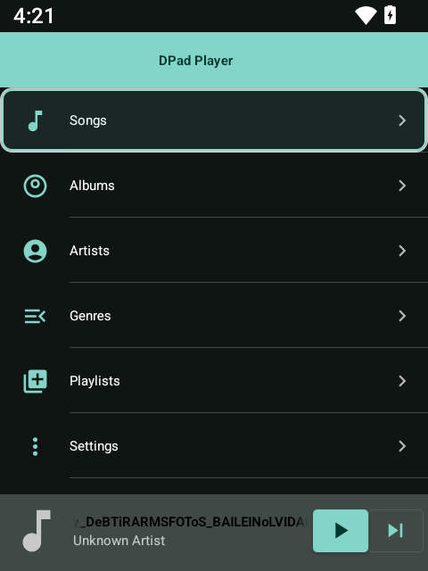
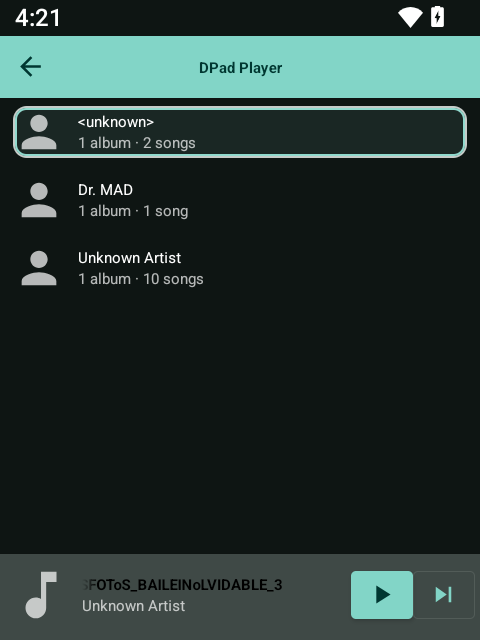

# D-PAD Player 🎵

D-PAD Player is a lightweight, functional Android media player demo built with Kotlin and ExoPlayer. It demonstrates how to build a modern local media playback app with background service support, media session integration, and battery-optimized notification controls.

## Screenshots

<p float="left">
  
  
  
</p>

## Features

- **Local Media Playback**: Scans and plays local audio files from the device.
- **Background Playback**: Utilizes a Foreground Service to keep music playing when the app is minimized.
- **Media Session Integration**: Fully integrates with Android's MediaSession, providing lock screen controls and Bluetooth media button support.
- **Battery Optimized**: Intelligently detaches the foreground service when music is paused, allowing the system to reclaim resources and users to easily swipe away the notification.
- **Modern UI**: Clean, responsive user interface.

## Getting Started

### Prerequisites

- Android Studio / Android SDK
- Command-line tools (`adb`)
- Java 21 (for Gradle compilation)

### Build and Install

To build the debug APK and install it directly to a connected USB debugging device, run the following command from the root of the project:

```bash
./gradlew clean assembleDebug && adb install -r app/build/outputs/apk/debug/app-debug.apk
```

### Launching the App via CLI

Once installed, you can launch the app directly from your terminal:

```bash
adb shell am start -n com.example.dpadplayer/.MainActivity
```

## Development Notes

- **Architecture**: The app is located in the `app/` module and uses a standard Android Gradle build system (Gradle 8.9).
- **Icons**: Uses adaptive icons (XML vectors) for crisp rendering on all Android versions.
- **Dependencies**: Built primarily with AndroidX libraries and ExoPlayer.

## License

This project is licensed under the [MIT License](LICENSE).
